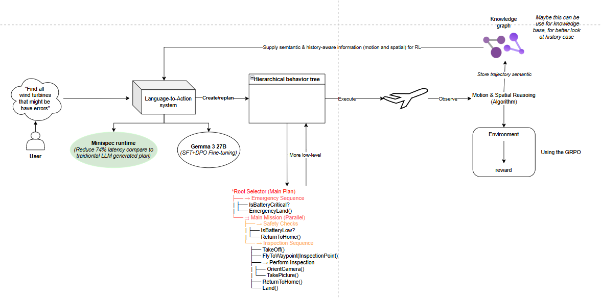

# Language-to-Action: How LLMs Efficiently Control Drones

This project explores how Large Language Models (LLMs) can be leveraged to efficiently control drones through natural languages. It provides a modular framework for data generation, simulation, training, and inference, enabling research and development in language-driven drone control.

## Model
- [Qwen2.5-7B-Drone](https://huggingface.co/Vantuk/Qwen2.5-7B-Drone) — My Pretrained LLM for drone control tasks.



## Features
- **Data Generation**: Algorithms for generating training data using templates and path planning (A*, Dijkstra, RRT).
- **Simulation Environment**: Integration with PyBullet for realistic drone simulation (`gym-pybullet-drones`).
- **Training & Inference**: Scripts for supervised fine-tuning (SFT), LoRA-based inference, and post-training evaluation.
- **LTA_Interpreter**: A lightweight specification language for defining drone skills and actions.
- **Utilities**: Helper scripts for template generation and data processing.

## Directory Structure
```
├── data_generate/         # Data generation algorithms and templates
├── gym-pybullet-drones/   # Drone simulation environment (PyBullet)
├── lta_interpreter/       # Interpreter
├── post_training/         # Training, inference, and dataset scripts
├── utils/                 # Utility scripts
```

## Getting Started
1. **Clone the repository**
   ```powershell
   git clone https://github.com/Tuprott991/Language-to-Action-How-LLMs-Efficiently-Control-Drones.git
   ```
2. **Install dependencies**
   - Python 3.11+
   - Install required packages:
     ```powershell
     pip install -r gym-pybullet-drones/requirements.txt
     ```
3. **Generate Data**
   - Use scripts in `data_generate/` to create training data.
4. **Train Models**
   - Run `post_training/new_sft.py` for supervised fine-tuning.
   - Use `new_infer.py` for LoRA-based inference.
5. **Simulate Drones**
   - Launch environments in `gym-pybullet-drones/envs/` for testing and evaluation.

## Example Usage
- Generate a dataset:
  ```powershell
  python data_generate/generator.py
  ```
- Train a model:
  ```powershell
  python post_training/new_sft.py
  ```
- Run inference:
  ```powershell
  python post_training/new_infer.py
  ```

## Acknowledgements
- [gym-pybullet-drones](https://github.com/utiasDSL/gym-pybullet-drones)
- PyBullet
- Hugging Face Transformers

---
For questions or contributions, please open an issue or pull request on GitHub.
